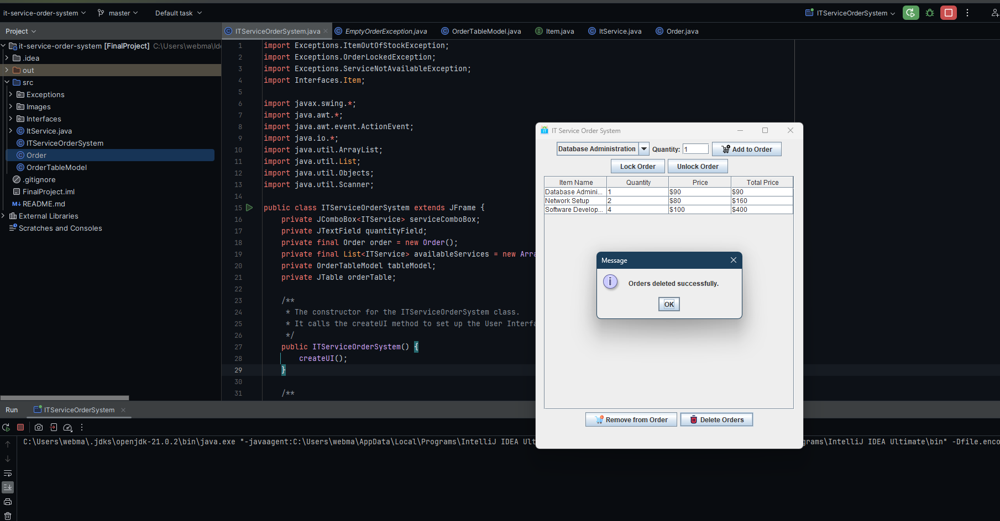

# IT Service Order System

This is a simple Java Swing Application that I've created as an assignment for my Java Programming course.

## Description

The IT Service Order System is a Java Swing application designed to manage IT service orders. It allows users to add IT services to an order, specify quantities, and manage the order by locking, unlocking, and deleting orders. The application also supports loading orders from a file on startup and saving orders to a file.

## Screenshots

<!-- Screenshots -->

## Features

- Add IT services to an order with specified quantities
- Display order items in a table with item details
- Remove items from an order
- Lock and unlock orders to prevent or allow modifications
- Load orders from a file on application startup
- Save orders to a file
- Delete the orders file and clear current order data
- User-friendly GUI with button icons and a title logo

## Usage

1. **Add Order Item**: Select an IT service from the dropdown and specify the quantity. Click "Add to Order" to add the item to the order.
2. **Remove Order Item**: Select an item from the order table and click "Remove from Order" to remove the selected item.
3. **Lock/Unlock Order**: Click "Lock Order" to prevent further modifications. Use "Unlock Order" to allow modifications again.
4. **Delete Orders**: Click "Delete Orders" to remove all order data and the associated "orders.txt" file.

## Customization

- To add or remove IT services, modify the `availableServices` list in the `ITServiceOrderSystem` class.
- Customize the GUI by changing the icons and title logo in the `createUI` method.

## Contributing

Contributions are welcome! Please feel free to submit pull requests or open issues to improve the application or add new features.

## License

This project is licensed under the MIT License - see the LICENSE.md file for details.